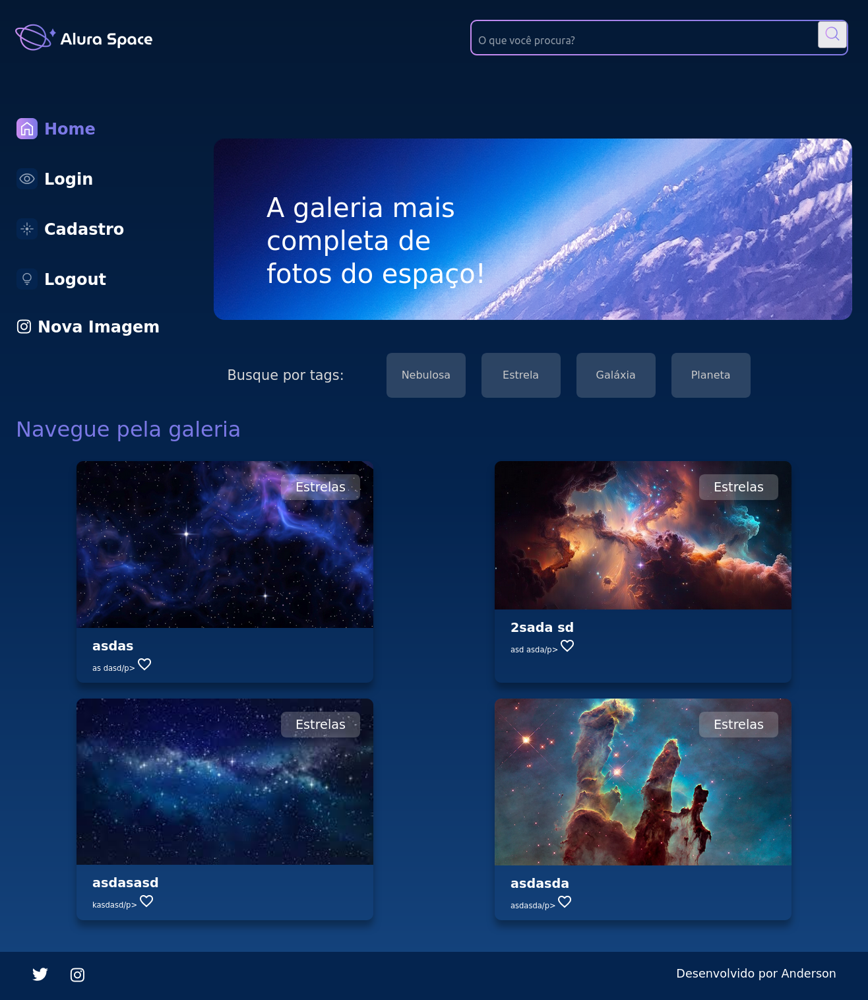
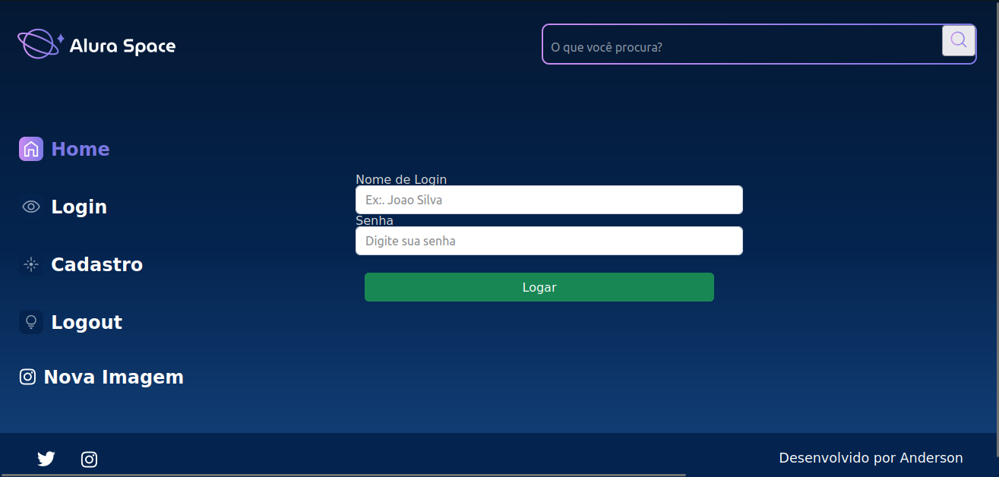
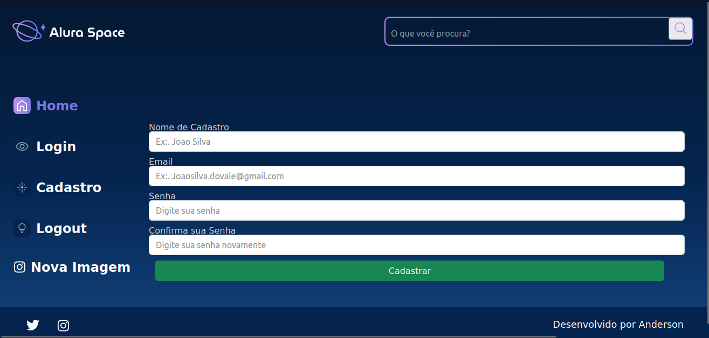
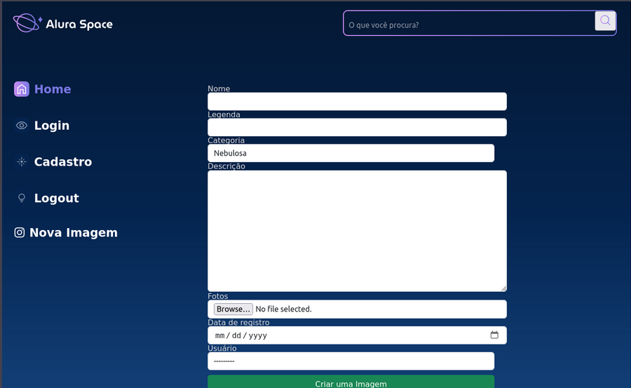
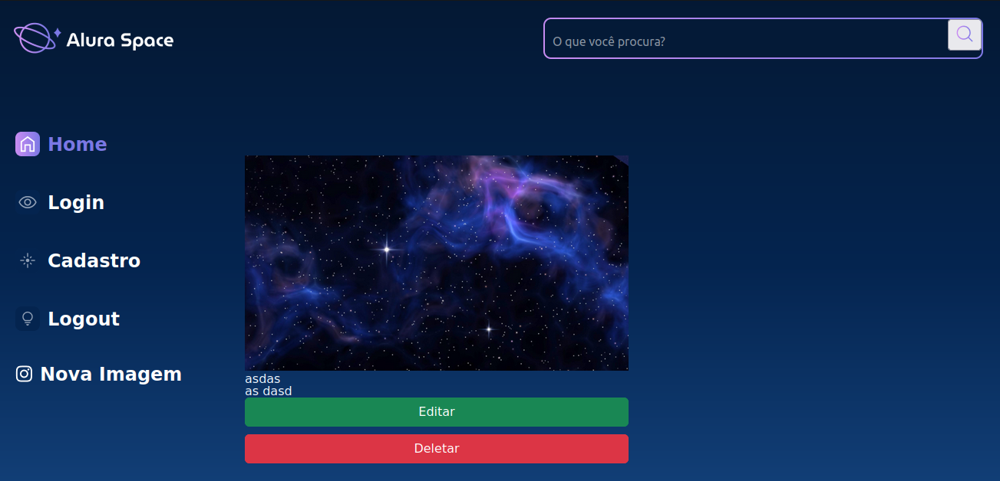

<h1 align="center"> Blog de Fotos do Espaço </h1>

<div align="center">


</div>


## Sumário

* [Descrição](#descrição)
* [Requisitos](#requisitos)
* [Tecnologias](#tecnologias)
* [Resultados](#resultados)
* [Como_Usar](#como_usar)
* [Conclusão](#conclusao)


## Descrição

O site "Alura Space" é uma galeria de imagens espaciais com um design moderno e intuitivo. Ele possui um menu lateral para navegação, com opções de login, cadastro e upload de imagens.

---

## Requisitos

* [x] Pagina e sistema de Cadastro
* [x] Pagina e sistema de Login
* [x] Pagina Menu para mostrar imagens postadas
* [x] Menu Lateral para Navegação
* [x] Botão para Postar uma Nova imagem
* [x] Editar e Deletar a Imagem postada pelo Usuario
* [x] Usuario poder buscar por imagens postadas
* [x] Sistema de busca de tags 
* [x] Botão para Deslogar Usuario
* [x] Header e Footer
* [x] Login Obrigatorio

---

## Tecnologias

- Django
- JavaScript
- Html
- Css
- SqLite

---

## Resultados


<div align="center">


| Imagem | Descrição |
|--------|-----------|
| <div align="center"></div> | <p style="font-size:40px; font-weight: bolder; text-align:center;">**Menu Principal**</p> |
| <div style="text-align:center;"></div> | <p style="font-size:40px; font-weight: bolder; text-align:center;">Login</p> |
| <div style="text-align:center;"></div> | <p style="font-size:40px; font-weight: bolder; text-align:center;">Cadastro</p> |
| <div style="text-align:center;"></div> | <p style="font-size:40px; font-weight: bolder; text-align:center;">Criar Imagem</p> |
| <div style="text-align:center;"></div> | <p style="font-size:40px; font-weight: bolder; text-align:center;">Editar/Deletar</p> |
</div>


---

## Como_Usar

### 1. Clonar o projeto do github
Se o projeto está em um repositório Git, clone-o em sua máquina:

```bash
git clone https://github.com/and3510/SpaceBlog_Project
```

### 2. Criar e ativar um ambiente virtual
No diretório do projeto, crie e ative um ambiente virtual (caso o projeto não esteja usando um):

```bash
python -m venv myenv
```

Ative o ambiente virtual:

- **Windows**:
  ```bash
  myenv\Scripts\activate
  ```
- **Linux/macOS**:
  ```bash
  source myenv/bin/activate
  ```

### 3. Instalar as dependências
O projeto existente provavelmente terá um arquivo `requirements.txt` com todas as bibliotecas necessárias. Instale-as com:

```bash
pip install -r requirements.txt
```

### 4. Configurar o banco de dados
Se o projeto usa um banco de dados (geralmente o arquivo de configuração `settings.py` vai conter essa informação), pode ser necessário configurar o banco.

- Se o projeto usa SQLite, o banco pode já estar incluso no diretório do projeto.
- Se usa PostgreSQL, MySQL ou outro banco de dados, configure a conexão no arquivo `settings.py` e crie o banco se necessário.

### 5. Aplicar as migrações
Com o banco de dados configurado, aplique as migrações para criar as tabelas:

```bash
python manage.py migrate
```

### 6. Coletar arquivos estáticos (opcional)
Se o projeto usa arquivos estáticos (CSS, JavaScript, imagens, etc.), você pode coletá-los em uma única pasta com o comando:

```bash
python manage.py collectstatic
```

### 7. Rodar o servidor de desenvolvimento
Agora, você pode iniciar o servidor:

```bash
python manage.py runserver
```

O servidor rodará em `http://127.0.0.1:8000/`, e você pode acessar o projeto no navegador.

### 8. Criar um superusuário (se necessário)
Se o projeto inclui o Django Admin e você não tem credenciais de superusuário, crie um:

```bash
python manage.py createsuperuser
```

Preencha as informações necessárias e você poderá acessar o Django Admin em `http://127.0.0.1:8000/admin/`.

---

## Conclusão

Este projeto de galeria de imagens do espaço permitiu não apenas explorar a vastidão e a beleza do universo, mas também aprimorar habilidades técnicas no desenvolvimento web. Através da integração de imagens astronômicas, foi possível criar uma experiência visualmente envolvente e educativa, destacando a importância do espaço e suas maravilhas. Embora a interface não seja tão atraente, este projeto foi essencial para aprimorar minhas habilidades. Meu principal foco foi estudar e entender as vantagens do Django, mostrando como a tecnologia pode ser usada para aproximar o cosmos de todos e despertar fascínio pela astronomia.


